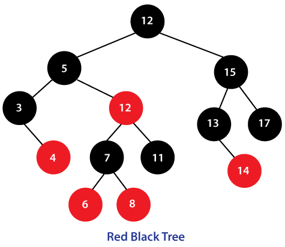
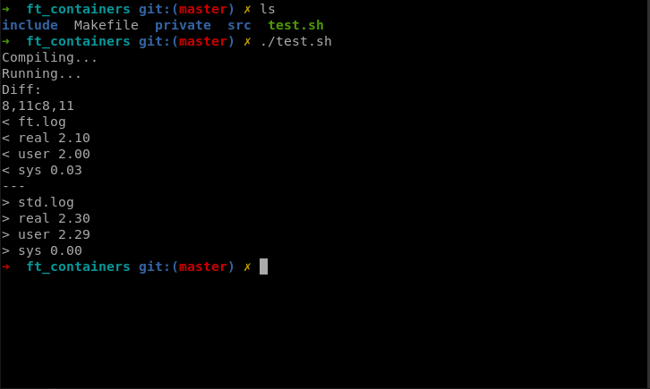

# Welcome to my ft_containers 42 project!

The purpose of this project is reimplementing some containers from the C++ STL with some restrictions.

## Table of contents
1. [List of mandatory implementation](#mandatory-implementation-list)
2. [Restrictions](#restrictions)
3. [Mandatory part](#mandatory-part)
4. [Testing part](#testing-part)

## Mandatory implementation list
* vector (without vector<bool> specialization)
* map
* stack (with our vector as default underlying container)
* iterator_traits
* reverse_iterator
* enable_if
* is_integral
* equal and/or lexicographical_compare
* pair
* make_pair

## Restrictions
* C++98 only
* No external library (like Boost)
* Function ```*printf()``` is forbidden (we will use ```std::cout <<```, etc)
* Functions ```*alloc()``` and ```free()``` are forbidden too (we have to use ```std::allocator``` instead)

## Mandatory part
For the map I decided to use a red-black tree to have the same complexity as the STL. In the implementation of the red-black tree class,
each leaf node point on ```NULL``` on right and left childs and the root node point on a nil node as parent.
This nil node point on the the max value node on his left child. I relied on the structure of ```std::map``` for the structure of my red-black tree class.



## Testing part
We have to provide some tests that compare our implementation to the STL. We need to compare outputs and performance / timing (we can be up to 20 times slower).
</br> </br>
For that part I decided to use a macro ```NAMESPACE``` that I define one time to ```std``` and one time to ```ft```.
So I can use the same files to make two binaries to compare. I did a script ```test.sh``` that make the two binaries and launch each one with the command ```time```,
redirecting the outputs in a log file and launch the command ```diff```.


